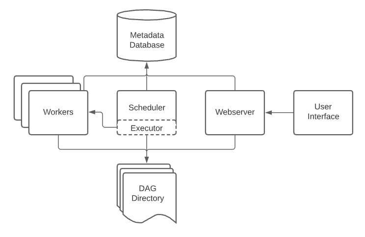
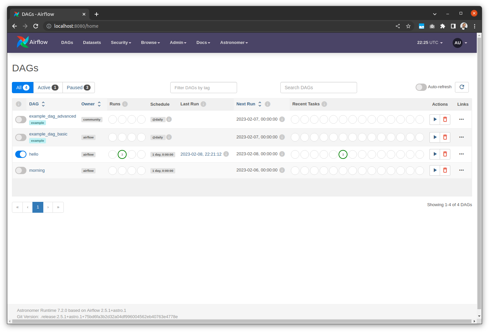

Apache Airflow Workshop - Part1
=================================

Apache Airflow is an open source tool for programmatically authoring, scheduling, and monitoring data pipelines. It has over 9 million downloads per month and an active OSS community. Airflow allows data practitioners to define their data pipelines as Python code in a highly extensible and infinitely scalable way.

<br>

In this workshop we will learn the basics of Apache Airflow by:

1. Running Airflow locally via [Astronomer CLI](https://docs.astronomer.io/astro/cli/overview)
2. Getting familiar with using **Airflow UI**
3. Understanding Airflow concepts such as **DAGs** and **Task Operators**
4. Authoring our own DAGs or _data pipelines_


## Prerequisites

This workshop requires the following components to be pre-installed on your machine:

- [Python](https://python.land/installing-python) (version 3.7 or higher)
- [VS Code](https://code.visualstudio.com/download) (or your IDE of choice!)
- [Docker](https://docs.docker.com/get-docker/)

**Docker** is required to run Airflow containers locally.


Clone the Project
=================

First, let's clone the project from our git repo. You can find our repo at: [https://github.com/datastackacademy/airflow-workshop](https://github.com/datastackacademy/airflow-workshop)

Open a command terminal and run:

```bash
git clone https://github.com/datastackacademy/airflow-workshop.git
```

Open the project in **VS Code**:

```bash
cd airflow-workshop
code .
```

To view these instructions in VS Code, open the [`README.md`](README.md) file press `CTRL` + `SHIFT` + `V`


Install Astro CLI
=================

We will install and run Airflow locally via the [Astronomer CLI](https://docs.astronomer.io/astro/cli/install-cli).

#### Mac OS

Open the Command terminal and run:

```bash
brew install astro
```

#### Linux and Windows WSL

Install the CLI by running the installer script in a bash terminal:

```bash
curl -sSL install.astronomer.io | sudo bash -s
```

#### Windows

Open a Windows PowerShell as an **administrator** and run:

```powershell
winget install -e --id Astronomer.Astro
```


Run Airflow
===========

Let's start Airflow and initialize with our pre-defined DAGs (_pipelines_) built in this workshop. 

We will use Astr CLI to initialize a local Airflow cluster on Docker. Please ensure that **Docker** is installed an running on your machine.

Start Airflow via Astro CLI

```bash
astro dev init
```

**NOTE:** You will get a warning regarding the folder not being empty. Press 'Y' to continue.

Let's review the project content created:

- `dags`: This folder contains the Python files for your Airflow DAGs (_pipelines_). This workshop seeds this folder with some pre-built DAGs.
- `Dockerfile`: This file contains a versioned Astro Runtime Docker image that provides a differentiated Airflow experience. 
- `include`: This folder contains any additional files or 3rd party libs that you want to include as part of your project.
- `packages.txt`: Install OS-level packages needed for your project by adding them to this file.
- `requirements.txt`: Install Python packages needed for your project by adding them to this file.
- `plugins`: Add custom or community plugins for your project to this file.
- `airflow_settings.yaml`: Use this local-only file to specify Airflow Connections, Variables, and Pools instead of entering them in the Airflow UI as you develop DAGs in this project.

Now, let's start Airflow:

```bash
astr dev start
```

This command starts a new Astronomer (Airflow) project and starts a series of docker containers running Airflow. 

**NOTE:** Please allow this command to run for a few minutes.

Let's review the Airflow architecture while this command finishes setting up Airflow:



- Postgres: Airflow's Metadata Database
- Webserver: The Airflow component responsible for rendering the Airflow UI
- Scheduler: The Airflow component responsible for monitoring and triggering tasks
- Triggerer: The Airflow component responsible for triggering deferred tasks

<br>

Open a browser and navigate to Airflow UI: [http://localhost:8080](http://localhost:8080/home)




